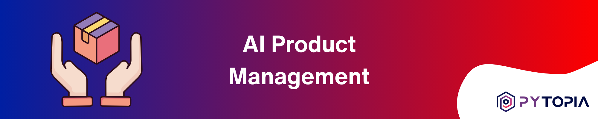
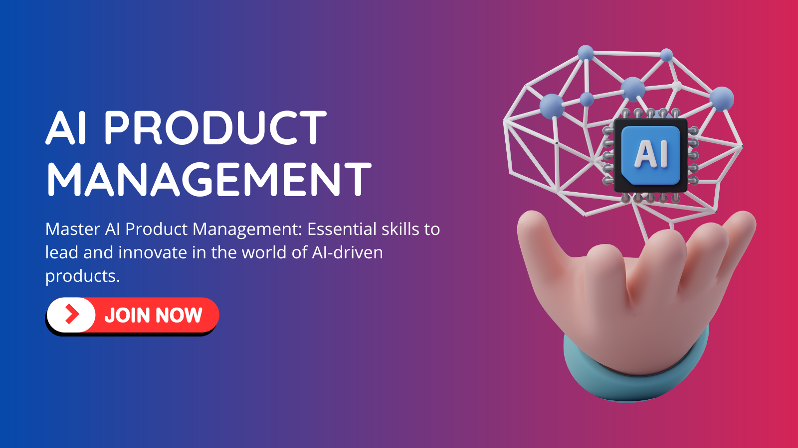

# AI Product Management Course Repository

Welcome to our comprehensive AI Product Management Course Repository. This course is designed for product managers looking to transition into AI product management or enhance their skills in this rapidly evolving field. From foundational concepts to advanced strategies, this course covers a wide range of topics essential for managing AI products effectively.

Our course is structured into several modules:

- **Foundations of AI for Product Managers**: Introduction to AI and Machine Learning, common ML problems and techniques, and data fundamentals for AI products.
- **AI Product Strategy and Planning**: AI product strategy and ideation, roadmapping and prioritization, cost estimation, and resource planning.
- **The AI Product Development Lifecycle**: Overview of the AI product development lifecycle, data strategy, and AI model development and evaluation.
- **Bringing AI Products to Life**: Productionizing ML models, AI product testing and quality assurance, and user experience design for AI products.
- **Measuring and Optimizing AI Products**: Measuring success of AI products and understanding trade-offs in AI product development.
- **Building and Managing AI Teams**: People and skills required in AI product teams.
- **Navigating the AI Landscape**: Legal and regulatory considerations, and future trends in AI product management.
- **Real-world Applications**: Case studies and practical applications of AI product management.

This repository contains all the projects, code templates, and resources you need to complete the course. Each project is designed to help you apply the concepts you learn in the course to real-world scenarios. You can use the provided code templates to build your projects and enhance your skills in AI product management.

# 🚦 Getting Started
To start using the projects in this repository:

- Clone the repo to your local machine: `git clone https://github.com/pytopia/python-programming.git`
- Navigate to the specific project directory and Start working on the project using the provided template code and following the project description.

# 🤝 Contributing
We welcome contributions from the community! If you have a project you'd like to add to this repository, please open a pull request. We'll review your project and merge it into the repository if it meets our standards.

# 📞 Contact Information

Feel free to reach out to us!

- 🌐 Website: [pytopia.ia](https://www.pytopia.ai)
- 💬 Telegram: [pytopia_ai](https://t.me/pytopia_ai)
- 🎥 YouTube: [pytopia](https://www.youtube.com/c/pytopia)
- 📸 Instagram: [pytopia.ai](https://www.instagram.com/pytopia.ai)
- 🎓 LinkedIn: [pytopia](https://www.linkedin.com/in/pytopia)
- 🐦 Twitter: [pytopia_ai](https://twitter.com/pytopia_ai)
- 📧 Email: [pytopia.ai@gmail.com](mailto:pytopia.ai@gmail.com)
